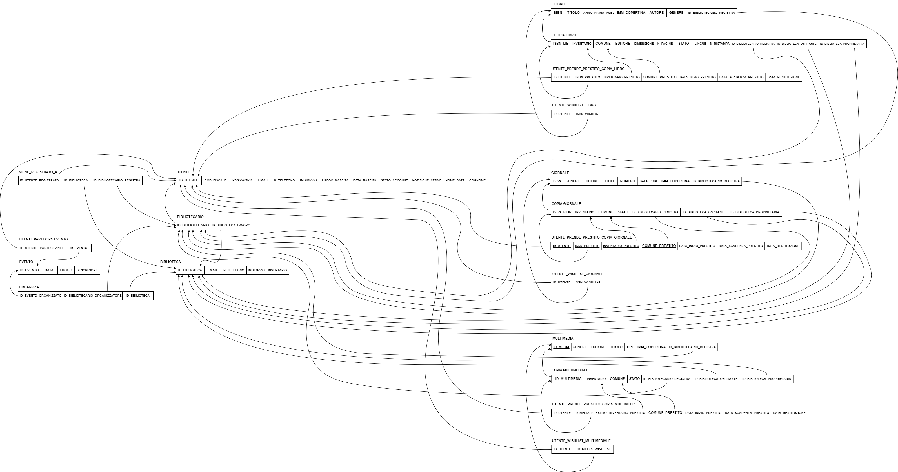

1) **Analisi Dei Requisiti**
Si vuole realizzare un’applicazione di basi di dati per la gestione del SISTEMA BIBLIOTECARIO PROVINCIALE. L’applicativo è usato sia dai bibliotecari provinciali che dagli utenti normali. La base di dati deve tenere traccia di: utenti, biblioteche, libri, contenuti multimediali, giornali ed eventi.

Per ciascun utente verrà memorizzato: codice fiscale, id numerico univoco, nome (che è composto da nome battesimo e cognome), data di nascita, luogo di nascita, indirizzo di residenza, numero di telefono, password e email univoca attraverso le quali accedono. Va, inoltre, memorizzato lo stato del suo account (attivo o bloccato) e se le notifiche sono impostate come attive o meno.

L’utente può essere registrato presso 0 o più biblioteche e può prendere in prestito da 0 a più copie di libri, giornali e contenuti multimediali dalle biblioteche presso cui è registrato. Per ogni prestito va memorizzata la data di inizio del prestito, la data di scadenza del prestito (calcolata a partire dalla data di inizio prestito + 30 giorni) e la data in cui è la copia è stata restituita.

L’utente può anche appartenere alla categoria Bibliotecario che, per essere tale, deve lavorare in una e una sola biblioteca.  Ogni bibliotecario può registrare da 0 a più utenti presso l’unica biblioteca in cui lavora. Ogni utente, in una singola biblioteca, può essere registrato da un solo bibliotecario. Oltre agli utenti un bibliotecario può registrare da 0 a più libri, giornali e multimedia se, quando deve inserire le informazioni della copia appartenente alla sua biblioteca non trova già il libro, giornale o multimedia registrati nella base di dati. Se il libro, giornale o multimedia di interesse è già registrato nella base di dati allora il bibliotecario può registrare da 0 a più copie dello stesso.

Per ciascuna biblioteca della provincia verrà memorizzato id biblioteca univoco, indirizzo, email, numero di telefono e numero totale degli elementi nel suo inventario. In una biblioteca lavorano uno o più bibliotecari. Non può esserci una biblioteca senza bibliotecari che ci lavorano.

A ogni biblioteca possono venire registrati più utenti ed è possibile che ad una biblioteca non sia registrato alcun utente.

Ogni biblioteca è proprietaria di 0 a più copie di libri, multimedia e giornali e inoltre può ospitare da 0 a più copie di libri, contenuti multimediali e giornali prestati da un’altra biblioteca.

Per ogni libro viene registrato da uno e uno solo bibliotecario: ISBN, l’autore, titolo, anno prima pubblicazione, immagine copertina, genere (compreso tra: biografia, fantascienza, fantasy, giallo, horror, thriller, narrativa per ragazzi, rosa, per bambini, storico, avventura, scienze, altro). Ogni libro ha da 0 a più copie libro e per ognuna di esse uno e uno solo bibliotecario deve registrare: id copia univoco (composto da numero inventario e codice comune), numero ristampa, casa editrice, dimensione, lingua, numero pagine, stato (ammesso al prestito, prestato, prenotato, in transito, solo consultazione, smarrito), biblioteca che ne è la proprietaria, biblioteca che la ospita (se non è prestato a nessuna altra biblioteca coincide con la biblioteca proprietaria). La copia è sempre di proprietà di una e una sola biblioteca e viene sempre ospitata da una e una sola biblioteca che può variare nel tempo. Ogni singola copia può essere data in prestito a un solo utente in contemporanea ma, durante il suo periodo di permanenza nel database, può essere prestata a più utenti.

Per ogni giornale viene registrato da uno e uno solo bibliotecario: ISSN, numero, data di pubblicazione, editore, titolo, immagine copertina, genere (compreso tra: cronaca, moda, musica e spettacolo, sport, politica, economia, attualità, altro). Ogni giornale ha da 0 a più copie e per ognuna di esse uno e uno solo bibliotecario deve registrare: id copia univoco (composto da numero inventario e codice comune), stato (ammesso al prestito, prestato, prenotato, in transito, solo consultazione, smarrito), biblioteca che ne è la proprietaria e biblioteca che la ospita (se non è prestato a nessuna altra biblioteca coincide con la biblioteca proprietaria). La copia è sempre di proprietà di una e una sola biblioteca e viene sempre ospitata da una e una sola biblioteca che può variare nel tempo. Ogni singola copia può essere data in prestito a un solo utente in contemporanea ma, durante il suo periodo di permanenza nel database, può essere prestata a più utenti.

Per ogni multimedia viene registrato da uno e uno solo bibliotecario: id multimedia univoco, tipo (cd o dvd), editore, titolo, immagine copertina, genere (compreso fra: horror, drammatico, commedia, thriller, fantascienza, romantico, documentario, animazione, western se dvd e fra: blues, metal, country, folk, funk, jazz, musica classica, pop, punk, rock, altro se cd). Ogni multimedia ha da 0 a più copie e per ognuna di esse uno e uno solo bibliotecario deve registrare: id copia univoco (composto da numero inventario e codice comune), stato (ammesso al prestito, prestato, prenotato, in transito, solo consultazione, smarrito), biblioteca che ne è la proprietaria e biblioteca che la ospita (se non è prestato a nessuna altra biblioteca coincide con la biblioteca proprietaria). La copia è sempre di proprietà di una e una sola biblioteca e viene sempre ospitata da una e una sola biblioteca che può variare nel tempo. Ogni singola copia può essere data in prestito a un solo utente in contemporanea ma, durante il suo periodo di permanenza nel database, può essere prestata a più utenti.

Ogni utente può, inoltre, inserire nella propria wishlist da 0 a più libri, giornali e multimedia e ogni libro, giornale e multimedia può essere inserito nella wishlist da 0 a più utenti.

Ogni bibliotecario può organizzare da 0 a più eventi per la sola biblioteca presso in cui lavora. Ogni evento può essere organizzato da un solo bibliotecario. Per ogni evento si memorizzano id evento, data, luogo e descrizione. Ogni utente può partecipare a 0 o più eventi e ad ogni evento possono partecipare da 0 a N utenti.

Il diagramma ER comprenderà 7 entità forti (utente, bibliotecario, biblioteca, libri, multimedia, giornali, eventi)

2) **Progettazione dello schema ER/EER**

 
 
 
 
 
 
 
3) **Schema Relazionale**

1) Schema relazionale finale con vincoli di integrità referenziale

2\) Normalizzazione
1NF: lo schema è in 1NF in quanto non sussistono attributi multivalore, composti o loro combinazione.

2NF: Per le tabelle con una chiave primaria composta da un solo attributo il test è inutile (UTENTE, BIBLIOTECARIO, BIBLIOTECA, EVENTO, LIBRO, GIORNALE, MULTIMEDIA, VIENE\_REGISTRATO\_A, ORGANIZZA). 
UTENTE_ PARTECIPA_EVENTO, UTENTE\_WISHLIST\_LIBRO, UTENTE\_WISHLIST\_GIORNALE, UTENTE\_WISHLIST\_MULTIMEDIALE sono già in 2NF perché formate dalla sola chiave. 
In UTENTE\_PRENDE\_PRESTITO\_COPIA\_LIBRO, UTENTE\_PRENDE\_PRESTITO\_COPIA\_GIORNALE, UTENTE\_PRENDE\_PRESTITO\_COPIA\_MULTIMEDIA tutti gli attributi dipendono
funzionalmente in modo completo dalla chiave primaria.
Per COPIA_LIBRO sussistono la DF1: {<u>INVENTARIO, COMUNE</u>} -> {EDITORE, DIMENSIONE, N_PAGINE, STATO, LINGUE, N\_RISTAMPA, ID\_BIBLIOTECARIO\_REGISTRA}, 
la DF2: <U>COMUNE</U> -> ID\_BIBLIOTECA\_PROPRIETARIA
e la DF3: {<u>ISBN_LIB, INVENTARIO, COMUNE</u>} -> ID\_BIBLIOTECA\_OSPITANTE
per cui si normalizza la relazione in: 
![[Pasted image 20240530185028.png]]
Per COPIA_GIORNALE sussistono la DF1: {<u>INVENTARIO, COMUNE</u>} -> {STATO, ID\_BIBLIOTECARIO_REGISTRA},
la la DF2: <U>COMUNE</U> -> ID\_BIBLIOTECA\_PROPRIETARIA
e la DF3: {<u>ISSN\_GIOR, INVENTARIO, COMUNE</u>} -> ID\_BIBLIOTECA\_OSPITANTE
per cui si normalizza la relazione in: 
![[Pasted image 20240530185612.png]]
Per COPIA_MULTIMEDIA sussistono la DF1: {<u>INVENTARIO, COMUNE</u>} -> {STATO, ID\_BIBLIOTECARIO\_REGISTRA},
la la DF2: <U>COMUNE</U> -> ID\_BIBLIOTECA\_PROPRIETARIA
e la DF3: {<u>ID_MULTIMEDIA, INVENTARIO, COMUNE</u>} -> ID\_BIBLIOTECA\_OSPITANTE
per cui si normalizza la relazione in: 
![[Pasted image 20240530185915.png]]

3NF: In UTENTE\_PRENDE\_PRESTITO\_COPIA\_LIBRO si ha che DATA\_INIZIO\_PRESTITO -> DATA\_SCADENZA\_PRESTITO ma DATA\_INIZIO\_PRESTITO non è chiave quindi si normalizza la relazione in: 
![[Pasted image 20240530190244.png]]
 In UTENTE\_PRENDE\_PRESTITO_COPIA\_GIORNALE si ha che DATA\_INIZIO\_PRESTITO -> DATA\_SCADENZA\_PRESTITO ma DATA\_INIZIO\_PRESTITO non è chiave quindi si normalizza la relazione in: 
 ![[Pasted image 20240530190322.png]]
 In UTENTE\_PRENDE\_PRESTITO\_COPIA\_MULTIMEDIA si ha che DATA\_INIZIO\_PRESTITO -> DATA\_SCADENZA\_PRESTITO ma DATA\_INIZIO\_PRESTITO non è chiave quindi si normalizza la relazione in: 
 ![[Pasted image 20240530190415.png]]

3\) Schema relazionale normalizzato
![[Pasted image 20240530192239.png]]
![[Pasted image 20240530192305.png]]